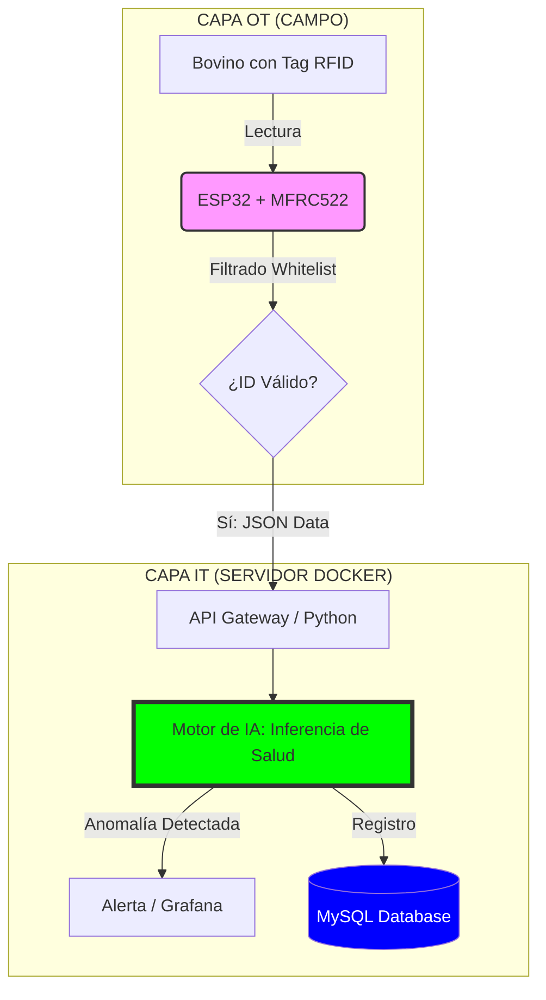

# 🐄 Arquitectura IIoT para Monitoreo Ganadero y Continuidad Operacional
**Autor:** José Bravo Aguilera  
**Estatus:** Proyecto de Título - Ingeniería en Automatización y Control Industrial  
**Calificación:** Distinción Máxima (6.9)

## 🎯 Visión General
Este proyecto implementa una solución ciberfísica (OT/IT) integral para la gestión ganadera. A través de la convergencia de hardware industrial (RFID + ESP32) y herramientas avanzadas de software (Docker, IA en Python, SQL), el sistema es capaz de detectar **anomalías de salud y brechas de seguridad (detección de intrusos)** en tiempo real, transformando datos de sensores en decisiones estratégicas.


## 🛠️ Stack Tecnológico
- **Capa Edge (OT):** ESP32, MFRC522 (RFID), C++ (PlatformIO).
- **Capa de Infraestructura:** Docker & Docker Compose (Microservicios) para aislamiento de procesos.
- **Capa de Datos:** MySQL (Persistencia), Pandas (ETL & Analítica).
- **Cerebro de IA:** Motor de Inferencia en Python para detección de anomalías.
- **Visualización:** Grafana Dashboards para monitoreo de KPIs en tiempo real.

## 🧠 Gestión de Ingeniería e IA
Documentación de Arquitectura: Diseño de flujos y lógica de datos mediante Mermaid.js (Documentation as Code).

Gestión de Conocimiento: Uso de NotebookLM para el entrenamiento en protocolos de hardware, síntesis de manuales técnicos y optimización de la base de conocimiento del proyecto.

Productividad: Apalancamiento en IA Generativa para el refactorizado de código y aceleración de ciclos de depuración.

## 🏗️ Arquitectura del Sistema
El sistema se basa en una arquitectura de microservicios orquestada para garantizar la **Resiliencia** y la **Escalabilidad**:

1. **Adquisición (Edge):** El ESP32 procesa lecturas RFID aplicando una "Whitelist" local.
2. **Procesamiento (Cerebro):** Motor en Python con lógica de **Ciberseguridad Perimetral** e Inferencia de Salud.
3. **Persistencia y Análisis:** Almacenamiento optimizado en MySQL para analítica masiva.

### 📐 Visualización de la Arquitectura (OT a IT)



## 📈 Metodología de Mejora Continua
Para el desarrollo de este sistema se aplicó un enfoque basado en **DMAIC** y **Lean**, buscando optimizar el flujo de tránsito de los activos biológicos y minimizar los falsos positivos en las alertas de seguridad. El sistema permite la etapa de "Medición"  y "Análisis" de manera automatizada.

## 🚀 Cómo Desplegar
El sistema está diseñado para ser "Plug & Play" mediante contenedores:

1. Clonar repositorio.
2. Configurar hardware ESP32 con el código en `/firmware`.
3. Ejecutar la infraestructura:
   ```bash
   docker-compose up -d
