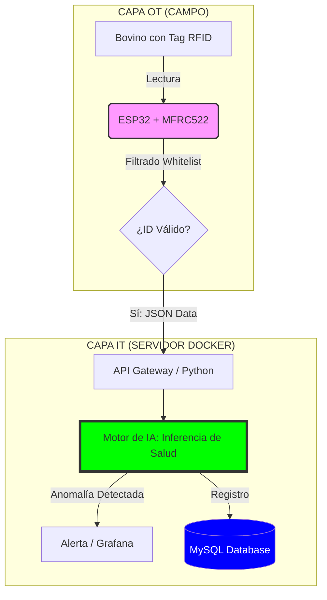

```mermaid
graph TD
    subgraph "CAPA OT (CAMPO)"
        A[Bovino con Tag RFID] -->|Lectura| B(ESP32 + MFRC522)
        B -->|Filtrado Whitelist| C{¿ID Válido?}
    end

    subgraph "CAPA IT (SERVIDOR DOCKER)"
        C -->|Sí: JSON Data| D[API Gateway / Python]
        D --> E[Motor de IA: Inferencia de Salud]
        E -->|Anomalía Detectada| F[Alerta / Grafana]
        E -->|Registro| G[(MySQL Database)]
    end

    style B fill:#f9f,stroke:#333,stroke-width:2px
    style E fill:#00ff00,stroke:#333,stroke-width:4px
    style G fill:#0000ff,color:#fff
```